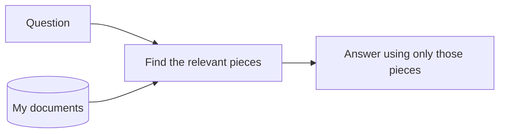
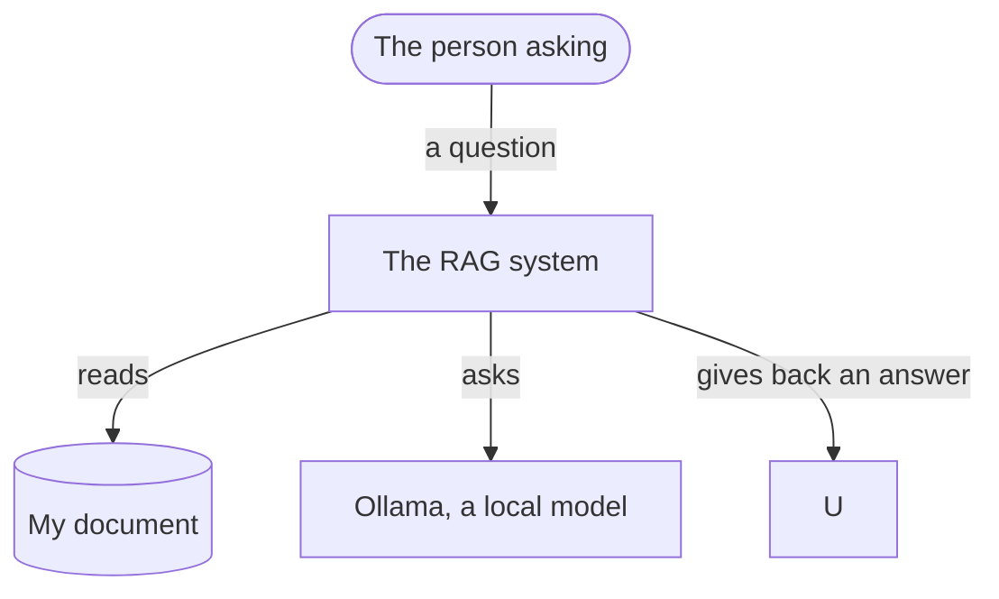
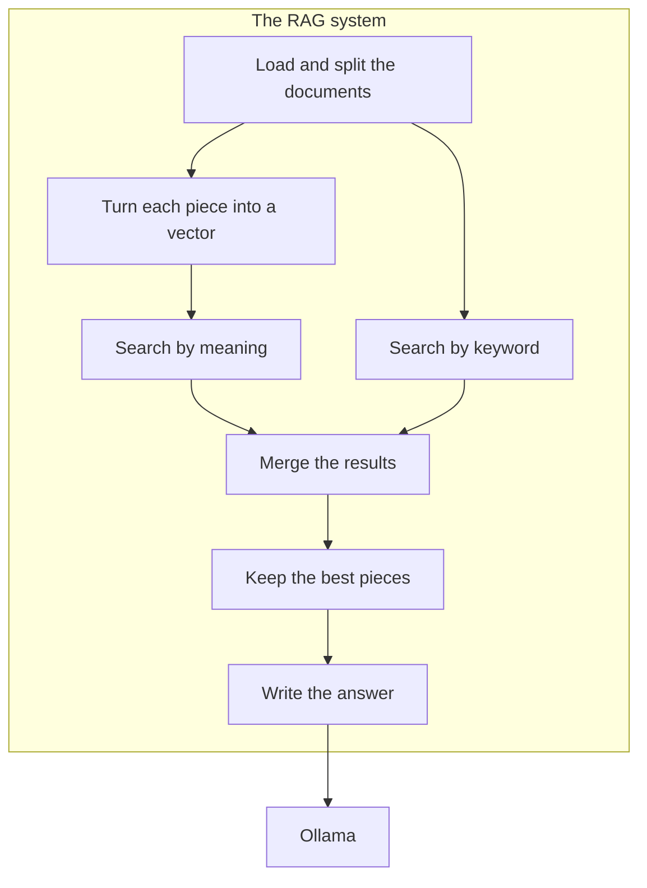
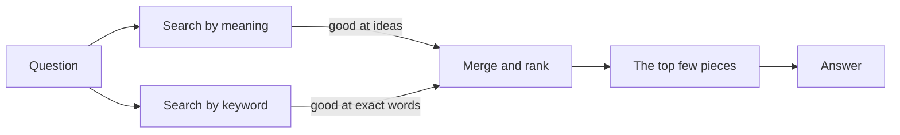

# Design

## The problem

Think of a language model as someone who has read a huge pile of books, but
stopped reading on one fixed day. Anything that happened after that day, it
simply hasn't seen. It also never read your private files, your notes, or your
team's documents. None of it.

So when you ask about something recwn documents
would know, it doesn't really have the answer. The annoying part is that it
rarely says "I don't know." It usuawer that just
happens to be wrong.

That is the problem I set out to fix. The answers go stale, and sometimes they
are simply made up.

## The idea: RAG

The idea behind RAG is pretty simplemember
everything. Instead, search your documents for the parts that matter, put those
in front of the model, and ask it thanded it.

Now the model works from a real source instead of its memory. If a fact changes
tomorrow, I don't retrain anything.

## How it fits together

To explain how it's built, I'll go the details, one
level at a time. That way you see the shape of the whole thing before getting
lost in the small parts.

### The big picture

At the top level there are only thr the system
itself, and the tools it leans on.

### The parts inside

Open up the system and here are the parts that do the work, roughly in the order
a document passes through them.

### A closer look at search

The most interesting part is the sethem at once
instead of one.

Why two? Search by meaning is clevell happily find
a paragraph about "vehicles." But it can trip over exact things like a product
code or a person's name. Keyword ses exact words
but has no clue that "car" and "vehicle" are related. Each one is weak right
where the other is strong, so I runind.

## The tools

None of these are fancy, and that ws I could run on
my own laptop and actually understand.

- **sentence-transformers** turns text into vectors, which is what makes the
  meaning-based search work
- **rank-bm25** does the keyword search. It's an old method but still hard to
  beat for exact matches
- **numpy** handles the math behind measuring how close two pieces of text are
- **pypdf** pulls the text out of P
- **Ollama** runs the model right on my machine, so there's no API key and
  nothing I feed it ever leaves the
- **pytest** and **ruff** keep the code tested and clean as I go 