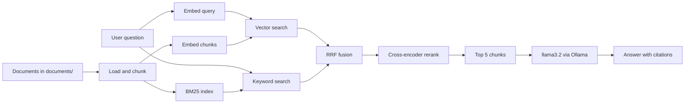

# Hybrid RAG

A local retrieval-augmented generation project that answers questions over a
document folder using hybrid retrieval, reranking, and a local LLM.

This repo is built to show the full RAG path end to end:

- document loading and chunking
- dense embedding search
- BM25 keyword search
- Reciprocal Rank Fusion
- cross-encoder reranking
- answer generation with citations
- retrieval evaluation on a small golden set

Everything runs locally. No cloud API is required.

## Pipeline Overview


```mermaid
flowchart LR
    A[Documents in documents/] --> B[Load and chunk]
    B --> C[Embed chunks]
    B --> D[BM25 index]
    Q[User question] --> E[Embed query]
    E --> F[Vector search]
    Q --> G[Keyword search]
    C --> F
    D --> G
    F --> H[RRF fusion]
    G --> H
    H --> I[Cross-encoder rerank]
    I --> J[Top 5 chunks]
    J --> K[llama3.2 via Ollama]
    K --> L[Answer with citations]
```

## What It Does

The system reads files from `documents/`, splits them into chunks, embeds those
chunks, and stores the index on disk. At query time it:

1. runs vector search over embeddings
2. runs BM25 keyword search over chunk text
3. merges both ranked lists with RRF
4. reranks the fused shortlist with a cross-encoder
5. sends the top chunks to `llama3.2` through Ollama
6. returns an answer with numbered citations

## Current Stack

- Embedding model: `BAAI/bge-small-en-v1.5`
- Reranker: `cross-encoder/ms-marco-MiniLM-L6-v2`
- Generator: `llama3.2` via Ollama
- Dense search math: `numpy`
- Keyword search: `bm25s`
- PDF loading: `pypdf`
- Tests: `pytest`

## Project Structure

```text
.
├── cli.py
├── documents/
├── eval/
│   └── golden.json
├── src/
│   ├── chunking.py
│   ├── config.py
│   ├── embedding.py
│   ├── evaluate.py
│   ├── generator.py
│   ├── hybrid_search.py
│   ├── keyword_search.py
│   ├── loader.py
│   ├── pipeline.py
│   ├── rerank.py
│   ├── retriever.py
│   ├── tokenizer.py
│   ├── types.py
│   └── vector_search.py
└── tests/
```

## How Retrieval Works

### 1. Loading and chunking

Supported input types are:

- `.md`
- `.txt`
- `.pdf`

Markdown is split in a heading-aware way. Blocks under the same heading path are
packed together until they reach roughly `350` tokens. Token counting uses the
embedding model tokenizer, not word count.

### 2. Dense retrieval

Each chunk is embedded with `BAAI/bge-small-en-v1.5`. Queries are embedded with
the BGE query prefix:

```text
Represent this sentence for searching relevant passages:
```

Because vectors are normalized, cosine similarity becomes a matrix multiply.

### 3. Sparse retrieval

BM25 runs over the raw chunk text. This helps with exact identifiers, version
numbers, names, and other keyword-heavy queries.

### 4. Fusion

The two ranked lists are merged with Reciprocal Rank Fusion:

```text
score = 1 / (60 + rank)
```

This avoids trying to compare BM25 scores directly against vector similarity
scores.

### 5. Reranking

The fused shortlist is rescored with
`cross-encoder/ms-marco-MiniLM-L6-v2`. Unlike the embedding model, the
cross-encoder reads the question and candidate chunk together and outputs a
relevance score.

### 6. Generation

The top reranked chunks are formatted into a prompt and sent to `llama3.2`
through Ollama. The prompt instructs the model to answer only from the provided
context and refuse unsupported claims.

## Index Files

Running the index step creates an `index/` folder containing:

- `embeddings.npy`
- `chunks.json`
- `manifest.json`

These files let the project reload the retrieval index without recomputing
embeddings every time.

## Usage

### 1. Install dependencies

```bash
python -m venv .venv
source .venv/bin/activate
pip install -r requirements.txt
```

### 2. Start Ollama and pull the model

```bash
ollama pull llama3.2
```

### 3. Build the index

```bash
.venv/bin/python cli.py index
```

### 4. Ask a question

```bash
.venv/bin/python cli.py ask "What is Reciprocal Rank Fusion?"
```

### 5. Show retrieved chunks without generation

```bash
.venv/bin/python cli.py ask "What is Reciprocal Rank Fusion?" --show --no-llm
```

### 6. Run evaluation

```bash
.venv/bin/python cli.py eval
```

## Evaluation

The repo includes a small golden set in `eval/golden.json`.

Each entry defines:

- a question
- the expected source document
- a phrase that should appear in a relevant retrieved chunk

The evaluation script reports retrieval metrics for:

- vector search
- BM25
- hybrid search

This is currently retrieval-focused evaluation, not full answer-quality grading.

## Why This Project Exists

The goal of this repo is to make the RAG pipeline understandable, inspectable,
and runnable on a local machine. It is intentionally small enough to follow
without hiding core retrieval logic behind a large framework.

## Current Limitations

- the golden set is still small
- evaluation does not yet measure `hybrid + rerank` separately
- the project is CLI-first, not a deployed app
- chunk IDs are content-based, which can collide if different documents contain
  identical chunk text

## Next Improvements

- add reranker-specific tests
- evaluate `hybrid + rerank` as its own mode
- expand the document set and golden set
- expose retrieval diagnostics in a small UI or API
- harden indexing and chunk identity for larger corpora
