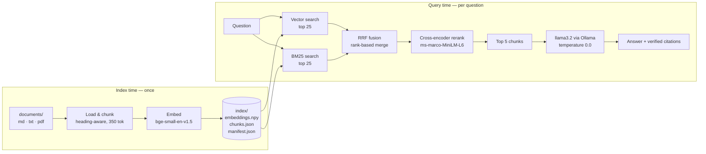

# Hybrid RAG

**A fully local, dependency-light RAG pipeline — hybrid retrieval, cross-encoder reranking, and cited answers. No cloud API, no vector database, no framework.**

<p>
  
  
  
  
  
</p>

Retrieval-augmented generation (RAG) means: instead of trusting an LLM's memory, you
search your own documents first and hand the model only the passages it is allowed to
answer from. This repo implements that path end to end, in plain Python, with every
stage readable in a single file.

Every component runs on your machine. Nothing leaves it.

---

## Contents

- [Why this repo](#why-this-repo)
- [Architecture](#architecture)
- [Quickstart](#quickstart)
- [CLI reference](#cli-reference)
- [How retrieval works](#how-retrieval-works)
- [Configuration](#configuration)
- [Evaluation](#evaluation)
- [Project structure](#project-structure)
- [Testing](#testing)
- [Limitations](#limitations)
- [Roadmap](#roadmap)

---

## Why this repo

Most RAG examples are either a 20-line toy or a framework wrapper that hides the part
that actually determines answer quality: retrieval. This one keeps retrieval in the
foreground.

| | |
|---|---|
| **Hybrid retrieval** | Dense embeddings *and* BM25 keyword search, fused by rank — so paraphrased questions and exact-identifier questions both work |
| **Two-stage ranking** | Cheap retrieval goes wide (25 candidates), an expensive cross-encoder rescores only the shortlist |
| **Verified citations** | Every answer carries `[n]` markers, and the pipeline flags any citation the model invented |
| **Measured, not asserted** | A golden set with `hit@1` / `hit@5` / `MRR` per retrieval mode and per question type |
| **Integrity-checked index** | The index is fingerprinted; a changed corpus or a changed embedding model is detected on load |
| **No hidden magic** | A small `src/` tree, no LangChain, no vector DB service |

## Architecture


```mermaid
flowchart LR
    subgraph Index["Index time — once"]
        A[documents/<br/>md · txt · pdf] --> B[Load & chunk<br/>heading-aware, 350 tok]
        B --> C[Embed<br/>bge-small-en-v1.5]
        C --> D[(index/<br/>embeddings.npy<br/>chunks.json<br/>manifest.json)]
    end

    subgraph Query["Query time — per question"]
        Q[Question] --> V[Vector search<br/>top 25]
        Q --> K[BM25 search<br/>top 25]
        D --> V
        D --> K
        V --> F[RRF fusion<br/>rank-based merge]
        K --> F
        F --> R[Cross-encoder rerank<br/>ms-marco-MiniLM-L6]
        R --> T[Top 5 chunks]
        T --> G[llama3.2 via Ollama<br/>temperature 0.0]
        G --> Z[Answer + verified citations]
    end
```

The two halves are deliberately separate: indexing pays the embedding cost once and
writes to disk, so `ask` starts in about a second instead of thirty.

## Quickstart

**Prerequisites** — Python 3.13 and [Ollama](https://ollama.com) running locally.

```bash
# 1. Environment
python -m venv .venv
source .venv/bin/activate
pip install -r requirements.txt

# 2. Local generator model
ollama pull llama3.2

# 3. Build the index from documents/
python cli.py index
# -> indexed 10 chunks from 1 documents

# 4. Ask
python cli.py ask "What is Reciprocal Rank Fusion?"
```

The embedding and reranker models download from Hugging Face on first use and are
cached locally afterwards.

To use your own corpus, drop `.md`, `.txt`, or `.pdf` files into `documents/` and
re-run `python cli.py index`. Unsupported file types are skipped with a warning.

## CLI reference

```bash
python cli.py index                      # build index/ from documents/
python cli.py ask "<question>"           # full pipeline: retrieve → rerank → generate
python cli.py eval                       # golden-set retrieval metrics
```

| Flag (on `ask`) | Effect |
|---|---|
| `--show` | Print the retrieved chunks alongside the answer |
| `--no-llm` | Retrieval only — inspect ranking without paying for generation |
| `--model NAME` | Override the Ollama model for this call |

Inspecting retrieval without the LLM is the fastest way to debug a bad answer:

```bash
python cli.py ask "Why was 350 picked as the maximum chunk size?" --show --no-llm
```

## How retrieval works

### 1 · Loading and chunking

Markdown is split **heading-aware**: blocks are grouped by their heading path and packed
together until they approach `350` tokens. Token counts come from the embedding model's
own tokenizer, not a word count — so a chunk can never silently overflow the model's
512-token window.

Each chunk carries its `doc_id`, `position`, and heading metadata, and the heading is
prepended to the text before embedding, so a chunk knows where it came from.

### 2 · Dense retrieval (semantic)

Chunks are embedded with `BAAI/bge-small-en-v1.5` into 384-dimensional vectors. Queries
get the prefix the BGE model family was trained with:

```text
Represent this sentence for searching relevant passages:
```

Vectors are normalized at encode time, so cosine similarity reduces to a single matrix
multiply in NumPy — no index structure, no approximate search. At this corpus scale that
is exact and instant.

**Strength:** paraphrases. *"Does this send my data to the internet?"* finds a passage
that says *"no cloud API is involved anywhere."*

### 3 · Sparse retrieval (lexical)

BM25 (via `bm25s`) scores the raw chunk text on term overlap.

**Strength:** exact tokens embeddings blur — version numbers, filenames, flags, proper
nouns, error strings.

### 4 · Fusion — Reciprocal Rank Fusion

BM25 scores and cosine similarities live on incomparable scales, so they are never added
directly. RRF discards the scores and merges on **rank** alone:

```text
score(chunk) = Σ  1 / (k + rank_in_that_list)      with k = 60
```

A chunk ranked #1 by one retriever contributes `1/61`; agreement across both retrievers
compounds. The constant `k` damps the top of each list so a single confident retriever
cannot outweigh a chunk both retrievers liked.

### 5 · Reranking — the quality stage

The embedding model encodes question and chunk **separately**, so it can only compare
two fixed summaries. A cross-encoder reads them **together in one sequence** and scores
actual relevance — far more accurate, and far too slow to run over a whole corpus.

Hence the funnel: retrieve 25 cheaply, rerank those 25 with
`cross-encoder/ms-marco-MiniLM-L6-v2`, keep the best 5. Cross-encoder cost stays bounded
regardless of corpus size, and the model is loaded once per process via a class-level
cache.

### 6 · Generation with citation checking

The top 5 chunks are numbered into the prompt, and the system prompt constrains the model
to the supplied context — if the answer is not there, it must say so rather than invent
one. `temperature = 0.0` keeps generation deterministic and anchored to the evidence.

Afterwards, `verify_citations` parses the `[n]` markers out of the answer and checks each
against the number of chunks actually supplied. A citation pointing at `[7]` when only
5 chunks were given is a hallucination, and it is reported instead of shipped silently.

## Configuration

Every knob lives in one frozen dataclass, `src/config.py`:

| Setting | Default | What it controls |
|---|---|---|
| `docs_dir` | `documents` | Corpus location |
| `index_dir` | `index` | Where the built index is written |
| `embed_model` | `BAAI/bge-small-en-v1.5` | Dense retriever (384-d) |
| `chunk_max_tokens` | `350` | Chunk ceiling, inside bge-small's 512 limit |
| `retrieve_n` | `25` | Candidates **per retriever**, before fusion |
| `rrf_k` | `60` | RRF damping constant |
| `rerank_model` | `cross-encoder/ms-marco-MiniLM-L6-v2` | Shortlist rescorer |
| `top_k` | `5` | Chunks that reach the LLM |
| `ollama_model` | `llama3.2` | Local generator |
| `temperature` | `0.0` | `0.0` = deterministic, evidence-anchored |

### Index integrity

`index/manifest.json` records the embedding model, the chunk size, and a SHA-256
fingerprint per source file. On load:

- **embedding model changed** → hard `RuntimeError`, because old vectors and new queries
  live in different spaces and the similarity numbers would be meaningless
- **documents changed** → warning that answers may be stale

This is the invariant the manifest protects: *queries must be embedded by the same model
that embedded the chunks.*

## Evaluation

`eval/golden.json` holds 15 labelled questions over the current corpus, tagged
`paraphrase` (semantic rewording) or `keyword` (exact term). Each entry names the
expected source document plus a phrase that must appear in a genuinely relevant chunk —
so a "hit" requires the right document *and* the right passage, not just a plausible
score.

Reported metrics, at `k = 5`:

- **hit@1** — the very first result was correct
- **hit@5** — a correct chunk appeared anywhere in the top 5
- **MRR** — mean reciprocal rank, `1/rank` of the first correct hit; rewards ranking it
  *higher*, not merely including it

### Measured results

`python cli.py eval` on the current corpus (10 chunks, 1 document):

| Mode | n | hit@1 | hit@5 | MRR |
|---|---:|---:|---:|---:|
| vector | 15 | 0.867 | **1.000** | **0.933** |
| bm25 | 15 | 0.733 | 0.867 | 0.789 |
| **hybrid** | 15 | **0.867** | **1.000** | 0.911 |

Broken out by question type — this is where hybrid earns its keep:

| Mode | paraphrase (n=8) | keyword (n=7) |
|---|---|---|
| vector | hit@1 0.750 · MRR 0.875 | hit@1 **1.000** · MRR **1.000** |
| bm25 | hit@1 0.625 · MRR 0.667 | hit@1 0.857 · MRR 0.929 |
| **hybrid** | hit@1 **0.750** · MRR 0.833 | hit@1 **1.000** · MRR **1.000** |

**Reading these honestly:** BM25 alone misses two paraphrase questions entirely — the
ones whose wording shares almost no vocabulary with the source passage. Hybrid recovers
both, matching the best hit@1 and hit@5 of either retriever while never inheriting
BM25's blind spot. Its MRR sits marginally below pure vector (0.911 vs 0.933) because
rank-based fusion occasionally demotes a chunk vector search had already placed at #1 —
the expected price of not letting either retriever fail alone.

At 10 chunks and 15 questions this is a **regression check, not a benchmark**. Ceilings
are easy to hit at this scale; the numbers are here to catch retrieval getting worse, and
to be re-measured as the corpus grows. Note also that `eval` measures the three
retrieval modes only — the reranker sits in `ask` and is not yet scored separately.

## Project structure

```text
.
├── cli.py                  # argparse entry point: index · ask · eval
├── documents/              # your corpus (md · txt · pdf)
├── index/                  # generated: embeddings.npy · chunks.json · manifest.json
├── eval/
│   └── golden.json         # 15 labelled retrieval questions
├── src/
│   ├── config.py           # every tunable, one frozen dataclass
│   ├── types.py            # Chunk — the record passed between all stages
│   ├── tokenizer.py        # shared tokenizer, so chunk sizes match the model
│   ├── loader.py           # files -> raw text (md · txt · pdf)
│   ├── chunking.py         # heading-aware, token-budgeted splitting
│   ├── embedding.py        # text -> normalized vectors
│   ├── vector_search.py    # dense retrieval (cosine via matmul)
│   ├── keyword_search.py   # BM25 retrieval
│   ├── hybrid_search.py    # Reciprocal Rank Fusion
│   ├── retriever.py        # HybridRetriever — composes the retrievers above
│   ├── rerank.py           # cross-encoder shortlist rescoring
│   ├── generator.py        # prompt assembly, Ollama call, citation verification
│   ├── evaluate.py         # golden-set harness (vector · bm25 · hybrid)
│   └── pipeline.py         # build_index · load_index · ask
└── tests/
```

Data flows one direction: `loader → chunking → embedding → {vector, keyword} → fusion →
rerank → generator`. Each module reads the previous stage's output and nothing else.

## Testing

```bash
python -m pytest -q
# 16 passed
```

Covered: chunk boundaries and token budgeting, embedding shape and normalization, hybrid
fusion ordering, and citation verification (including hallucinated-marker detection).

## Limitations

- **Corpus is a demo.** One document, 10 chunks. Metrics are directional at this size.
- **Reranking is unmeasured.** `eval` scores vector / bm25 / hybrid; `hybrid + rerank`
  needs its own mode before the reranker's contribution can be claimed.
- **Answer quality is ungraded.** Evaluation stops at retrieval. Faithfulness and
  answer correctness are not scored.
- **Content-derived chunk IDs.** Identical chunk text in two different documents collides.
  Fine for one corpus, wrong for a large heterogeneous one.
- **Exhaustive vector search.** The linear matmul is exact and fast at thousands of
  chunks; past that it needs an approximate index.
- **Full reindex on any change.** One edited file re-embeds the whole corpus.
- **CLI-first.** No API or web layer.

## Roadmap

- [ ] Score `hybrid + rerank` as a fourth evaluation mode
- [ ] Expand corpus and golden set; add unanswerable questions to test refusal
- [ ] Add reranker-specific tests
- [ ] Namespace chunk IDs by `doc_id` to remove collisions
- [ ] Incremental indexing driven by the manifest's per-file hashes
- [ ] Answer-level evaluation (faithfulness, citation precision)
- [ ] Retrieval-diagnostics API or small UI

## Stack

`sentence-transformers` · `bm25s` · `numpy` · `pypdf` · `ollama` · `pytest` · `ruff`

Pinned versions in `requirements.txt`.
